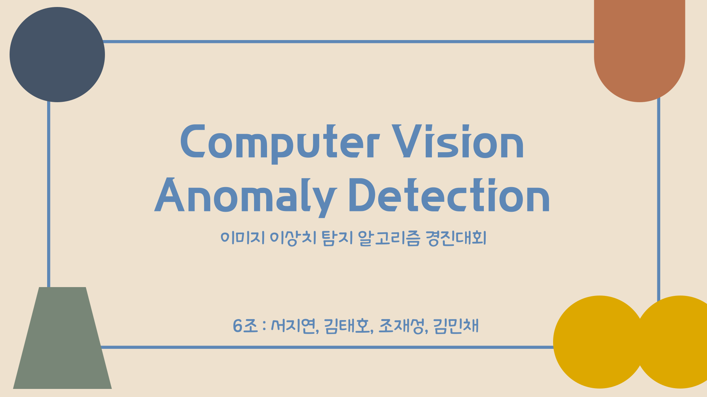
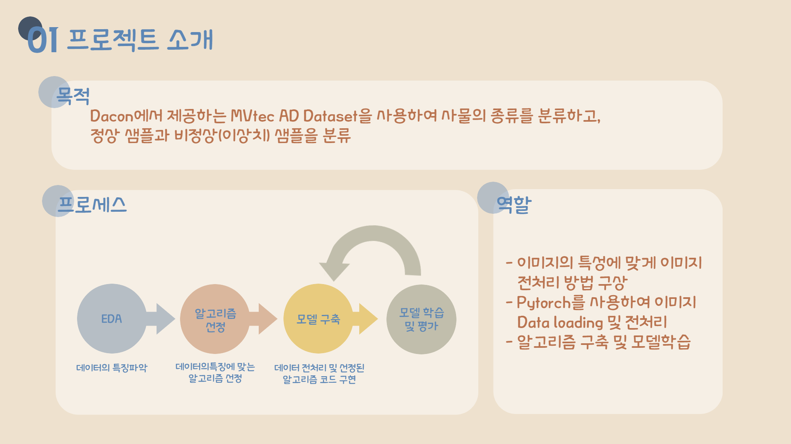
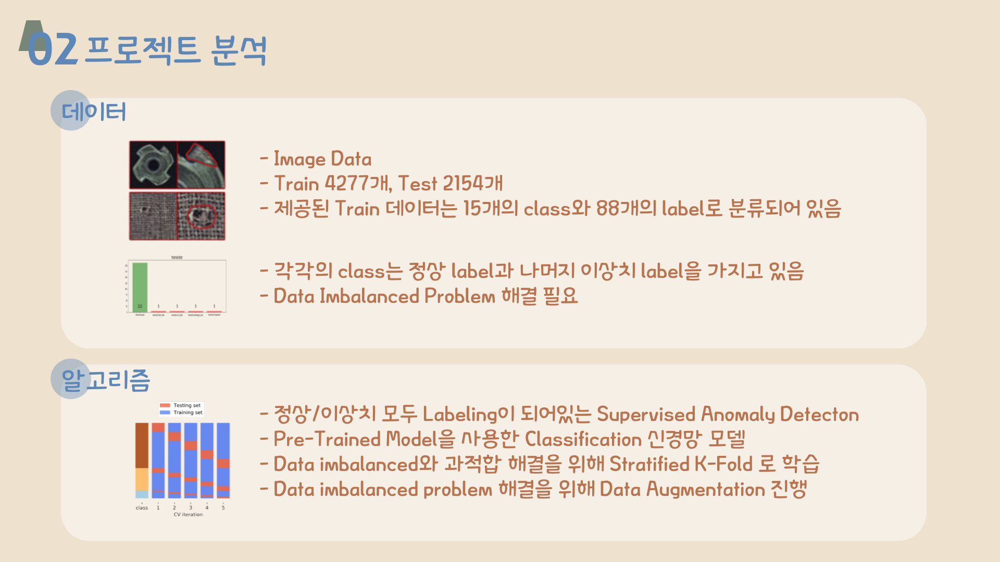
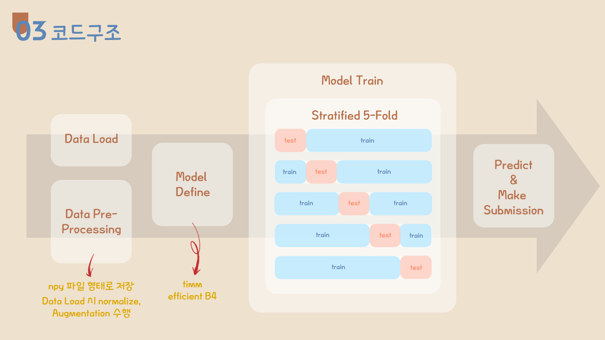
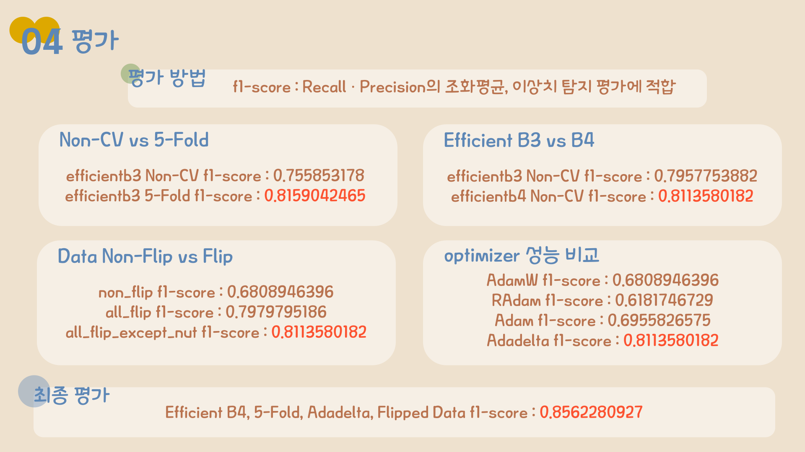

# Anomaly Detection Project
Computer Vision 이상치 탐지 알고리즘 경진대회

월간데이콘20 | anomaly detection | vision | macro-f1

팀원 : 4명

대회 기간 : `2022.04.01` ~ `2022.05.13`

프로젝트 기간 : `2022.04.25` ~ `2022.05.19`

## Index

- Purpose
- Environments
- Results
- Details

## Purpose

Dacon에서 제공하는 MVtec AD Dataset을 사용하여 사물의 중류를 분류하고, 정상 샘플과 비정상(이상치) 샘플을 분류

## Environments

| Category | Detail                               |
| -------- | ------------------------------------ |
| OS       | Windows                              |
| IDE      | Jupyter Notebook                     |
| Tool     | Python, Pytorch, Scikit-Learn, Putty |

## Summary

- train 4277, test 2154 개의 data set
- 15개의 class, 88개의 label로 분류된다.
- Data Agugmentation 적용
- Data imbalanced problem 해결을 위해 stratified K-Fold 적용
- pre-trained 모델로 efficientnet b4 사용
- 데이터의 불균형 때문에 fine tuning 제외

## Details

